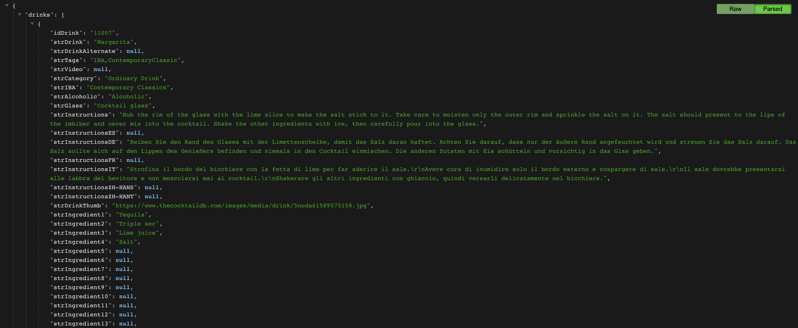
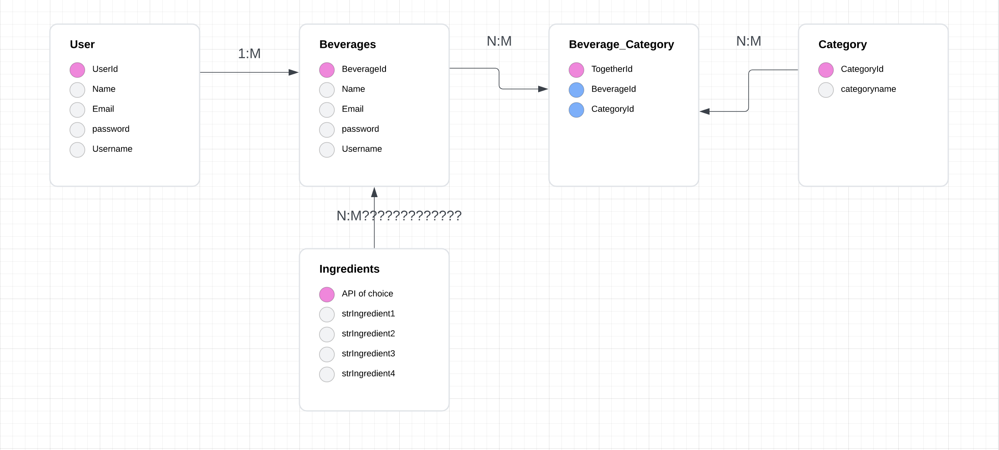
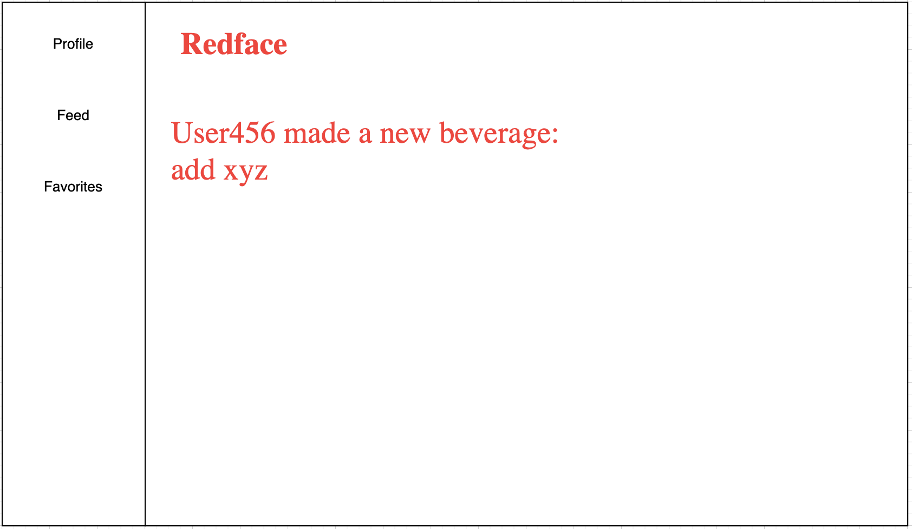

## RedFace

## Desciption
A social software used to provide users resources on making alcoholic beverages for special occasions for parties, events, etc.

## Installation Instructions
* Fork and clone this repository to your local directory
* Navigate to the directory in your terminal and run ` npm i -y` to install dependencies
* Run `touch .env `and type in the following code in the .env file:
``` ENC_SECRET='secret' ```
* Replace 'secret' with any string you like if necessary
* Go to https://www.thecocktaildb.com/api.php to generate an API calls for each coin..
* Setup your database (this app has four existing models)
  * Run `createdb auth_boilerplate` to create the database
  * Run `sequelize db:migrate` to run migrations
* Use `nodemon` to start your application
* Load up http://localhost:4000

## API
https://www.thecocktaildb.com/api.php


## ERDs


## Restful Routing Chart


## Wireframes


## User Stories
As a user, I want to see a list of recipes I have created.
As a user, I want to be able to see my feed.
As a user, I want to find inspiration from this program.
As a user, I want to see beverages from other users.

## MVP Goals
- An ability for users to create and login with secure authentication
- User profile displaying their very own recipes
- A user can find recipes 
- Accomplish CRUD
- Connected Postgress and SQL database with a table storing user information and a table for storing alcoholic beverages
- In addition, a table for storing favorited beverages for users

## Stretch Goals
- Create an appropriate theme
- Create features like comments and likes
